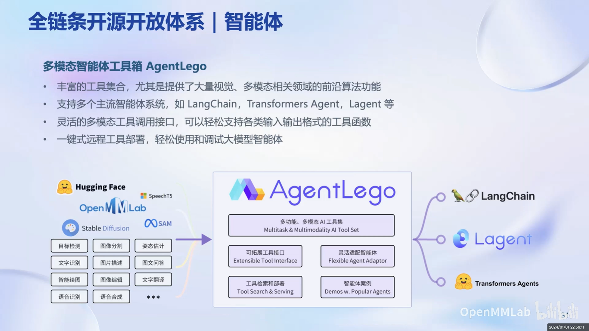

# LLM的工具箱：AgentLego

最近在根据这个[教程](https://www.bilibili.com/video/BV1Rc411b7ns)学习大模型方面的内容，看到这个PPT就想起了最近想做的一个tool市场的东西，因为这个AgentLego也有一堆的工具，同时也兼容各种Agent框架。

我看了下AgentLego的repo，自个写了份代码测试了下，发现还不错，雀食可以满足我的需求，就是没有我设想的社区化的功能，就是想HuggingFace那样让用户上传自己的Tools。

[自己测试的代码](./code.ipynb)