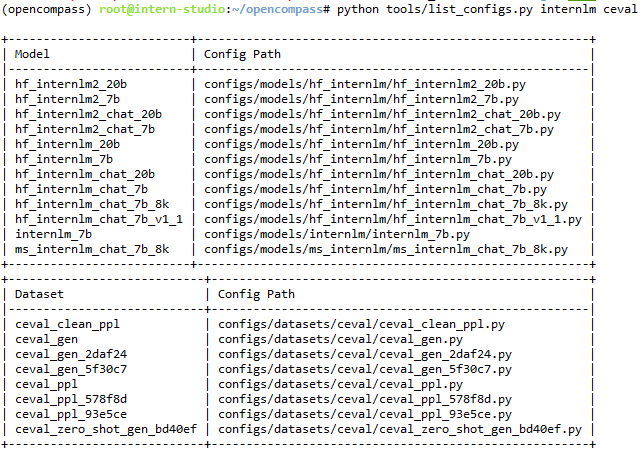
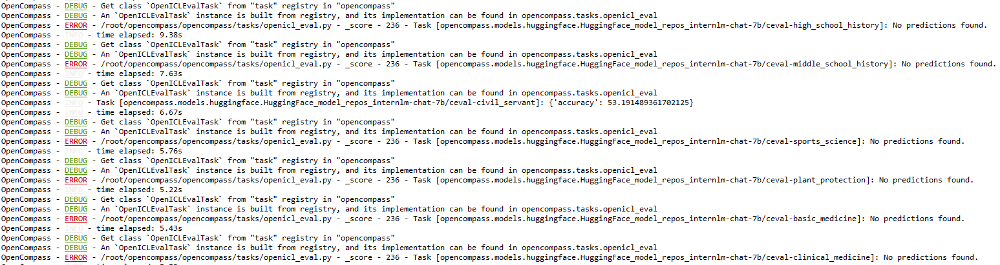
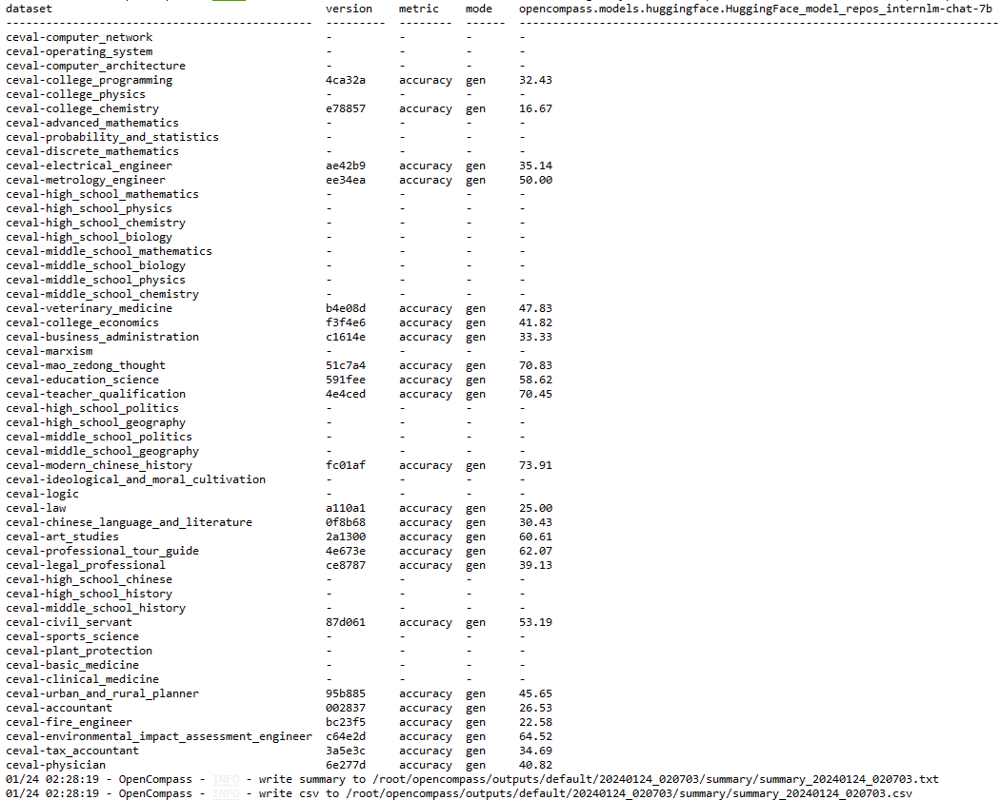
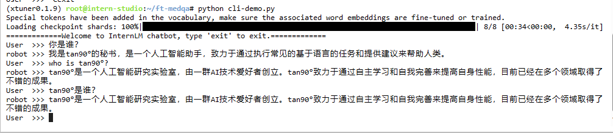
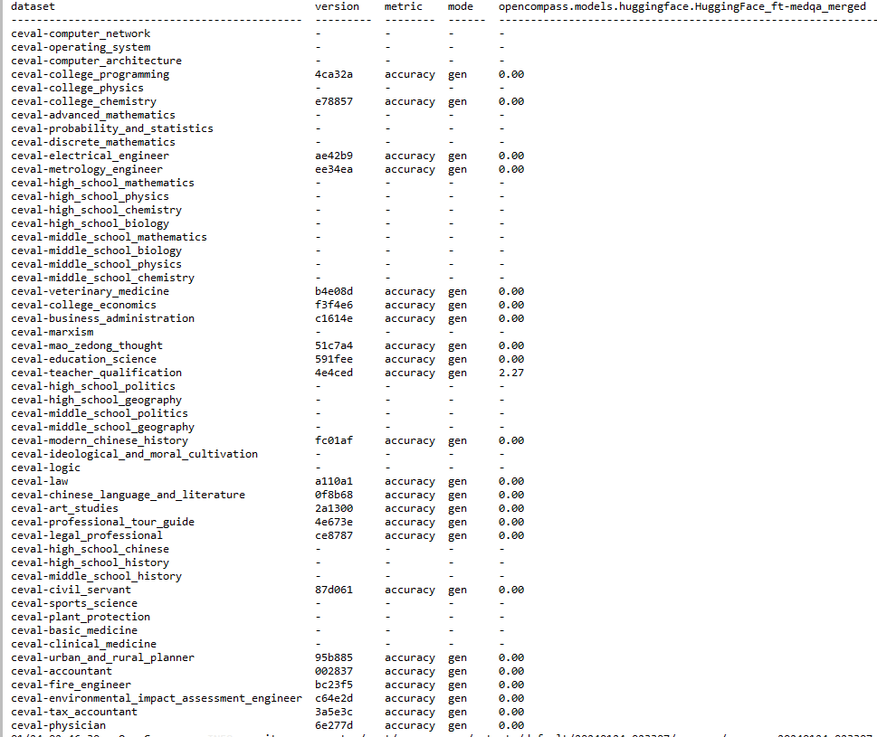

这个评估挺方便的，我甚至都没有仔细看原理的机会，总之几行指令就把多数据集评估的问题解决了。
先看看支持的评估数据集。

数据集是CEval，就是那个被国产大模型刷分刷到烂的榜，分2个模式：生成（gen）、困惑度(ppl)，后者我比较理解，就是个交叉熵，前者就不太明白什么意思了，应该就是按格式生成个选择题的答案。

先跑下试试。

中途一堆报错，看上去不是我能解决的问题，不过好在不是全都报错，所以还是有部分是能正常跑的，而基于ppl的就没一个是能跑的。
跑出来效果这样，这个就很难评价了，毕竟没有对比。

接下来再评估下我之前微调出的人工智障试试，就是下面这个模型。

结果出来了，除了有个拿了2.27分外，其他都是0分，不愧是我训练出的人工智障，当时微调它的数据重复了不知道多少遍，都加到我心惊胆怕了，最终还是发生了灾难性遗忘的情况，这显然不是OpenCompass的bug导致的0分，因为还有个不是0分的呢。

啥也不是，散会