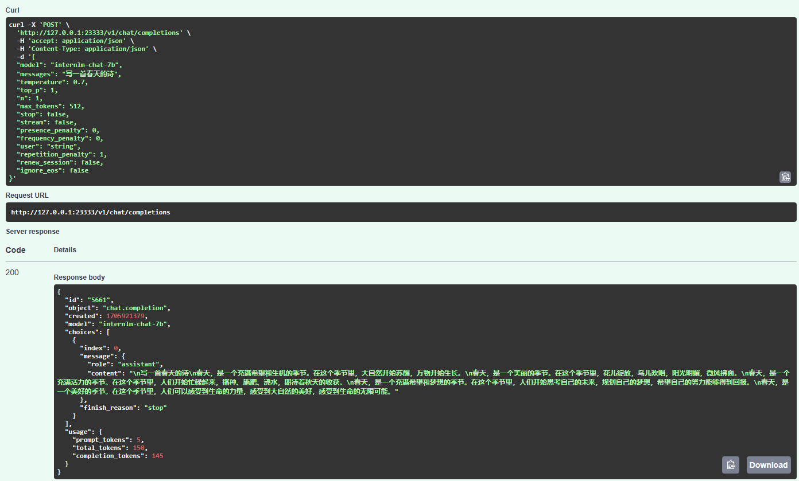
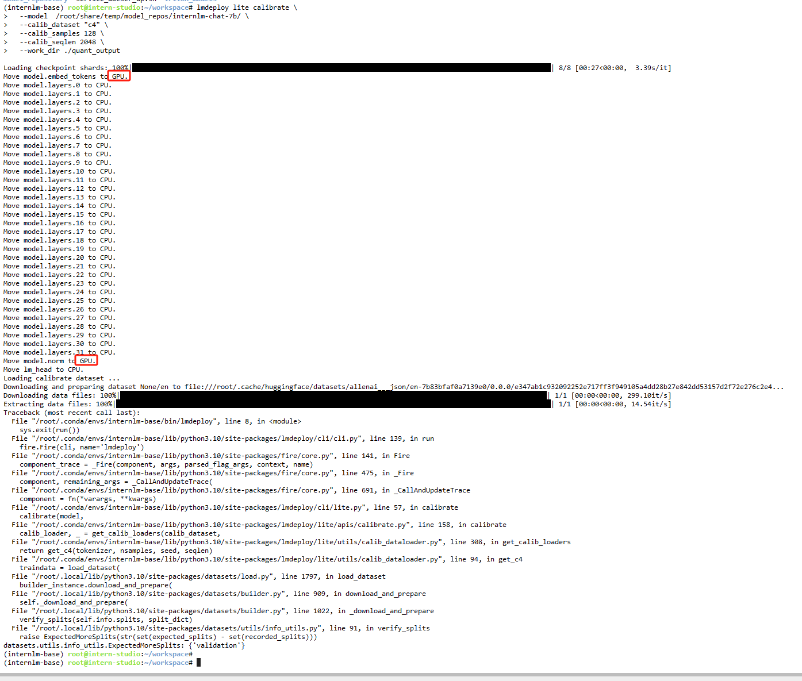

这期量化的教程有点难，如果是简单的把代码跑通，那还不是问题，但如果要把原理搞明白，那还挺难得，有些前置的概念教程里并没讲，比如CUDA的各种底层算子的实现，这些内容教程里并没有细讲，不去查阅外部资料是很难搞明白的，这里我就没搞明白了……

首先是部署 TurboMind 服务作为后端，前面各种转换就跳过了，这里打开用ssh端口
转发后的FastAPI在线文档测试效果。

总之能输出。

下一步试试KV int8 Cache，这一步教程写的有些歧义，前面告诉我，只要吧参数`quant_policy`改成4就能开启，而后面又在教我对模型进行KV int8 Cache 量化，而且还是导出新模型的那种，而我在没有进行转换的情况下，直接`quant_policy`改4也是能跑的，而且还真有效果，但是不明显……

简单做了个实验，在没有跑下面KV Cache转换的代码下开启KV Cache，用10个字的prompt做输入，显存占用大概少了70MB，不知道是不是偶然，

关闭KV Cache
显存 14822 / 20470 MiB

开启 KV Cache（int8）
显存 14758 / 20470 MiB

后面跑后续的代码，直接报错了，看上去BUG是没有在`c4`数据集上取出验证集，这个我就没想到怎么解决了。另外还有个奇怪的情况，这个模型有2层是加载在cpu里的，剩下的都是在gpu里的，这个不知道是不是bug。

