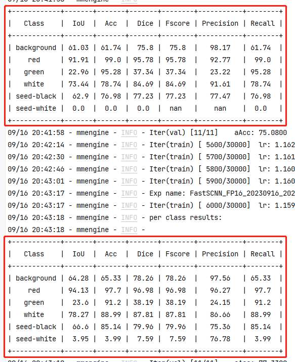

最近还在跟着子豪兄学MMSegmentation，这次就开始炼丹了。

[MMSegmentation训练语义分割深度学习算法](https://www.bilibili.com/video/BV1Ch4y1S7cX/?share_source=copy_web&vd_source=cb2a4f1f1d1664ceeb473790a3e7f1d0)

这把的任务就是，练一个能分割出西瓜各部位的语义分割模型。

刚开始俺用的算法还是UNet，因为我之前研究过这玩意，知道其参数少容易训练，但在开始训练后就傻眼了。

这玩意居然整整要我41天来炼丹，我的炼丹炉可撑不了这么久，于是呼在群里问了下，就换了更快的FastSCNN模型了，后面我去MMSegmentation的文档看了下，傻眼了。

UNet在医疗影像上表现优秀，但在常规的图像分割领域就捉襟见肘了，在城市街道数据集Cityscapes上，哪怕模型大到需要18G显存，也干不过仅需3.3G显存的FastSCNN……

在用上了FastSCNN模型后，俺就发现了个奇怪的现象

这个模型似乎出现了类似涌现的能力（Emergent Abilities），我称它为开窍。
在训练的前1/5阶段（6000/30000），这个模型对西瓜中的白子的识别能力是根本没有的，而正是在第6000轮，我的模型突然就能识别出白子了，突然就开窍了！？

笔记最后，给子豪兄转5块支持下，也感谢他的西瓜数据集~

